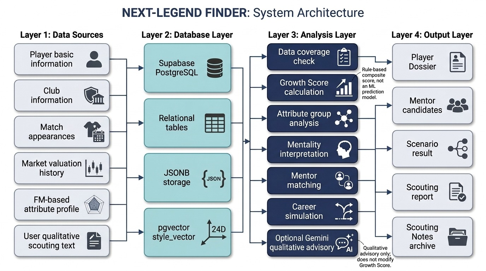
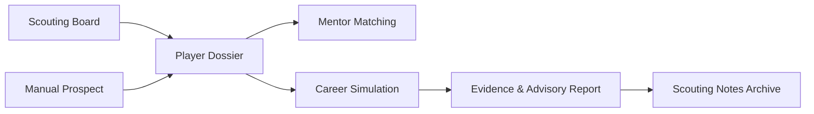

# NEXT-LEGEND FINDER

데이터베이스 기반 축구 유망주 스카우팅 및 성장 시나리오 분석 시스템

## 1. 프로젝트 개요

NEXT-LEGEND FINDER는 축구 유망주의 기본 정보, 시장가치, 출전 기록, 능력치 프로필, 멘탈리티 지표를 통합하여 선수의 강점과 보완점, 성장 가능성, 멘토 후보, 커리어 시나리오를 분석하는 웹DB 애플리케이션이다.

본 프로젝트의 핵심 목표는 단순 선수 검색 서비스가 아니라, 여러 출처의 선수 데이터를 데이터베이스에 구조화하고, 이를 기반으로 스카우팅 의사결정에 필요한 분석 결과를 생성하는 것이다. 사용자는 유망주를 검색한 뒤 선수의 현재 능력치와 성장 가능성을 확인하고, 유사한 능력치 패턴을 가진 멘토 후보를 참고하며, 훈련 강도와 출전 기회 등 조건 변화에 따른 성장 시나리오를 비교할 수 있다. 또한 분석 결과는 스카우팅 노트로 저장되어 이후 다시 조회할 수 있다.

본 시스템은 실제 미래를 예측하는 머신러닝 모델이 아니라, 현재 확보 가능한 데이터 안에서 유망주의 성장 가능성을 비교하고 해석하기 위한 데이터베이스 기반 의사결정 지원 시스템이다.

---

## 2. 시스템 아키텍처



Figure 1. NEXT-LEGEND FINDER의 전체 시스템 구조. 선수 기본 정보, 구단 정보, 출전 기록, 시장가치, FM 기반 능력치 프로필, 사용자 정성 텍스트를 Supabase PostgreSQL에 통합하고, JSONB와 pgvector를 활용하여 분석 결과 저장과 스타일 유사도 검색을 수행한다. Growth Score는 rule-based composite score이며, Gemini는 정성 텍스트 보조 분석에만 사용되고 점수 계산에는 직접 개입하지 않는다.

본 시스템은 크게 네 개의 계층으로 구성된다.

| Layer          | 역할                                                                                          |
| -------------- | ------------------------------------------------------------------------------------------- |
| Data Sources   | 선수 기본 정보, 구단 정보, 출전 기록, 시장가치, FM 능력치 프로필, 사용자 정성 텍스트 입력                                     |
| Database Layer | Supabase PostgreSQL, 관계형 테이블, JSONB 저장, pgvector style_vector 관리                            |
| Analysis Layer | 데이터 커버리지 확인, Growth Score 계산, 능력치 그룹 분석, 멘탈리티 해석, 멘토 추천, 커리어 시뮬레이션, Gemini 보조 분석            |
| Output Layer   | Player Dossier, Mentor Candidates, Scenario Result, Scouting Report, Scouting Notes Archive |

---

## 3. 프로젝트 설계 방향

초기 기획에서는 실제 경기 위치 이벤트 데이터를 활용하여 축구장을 10x10 Grid로 나누고, 각 구역별 행동 빈도를 기반으로 플레이스타일 벡터를 구성하는 방식을 고려하였다. 그러나 현재 확보한 CSV 데이터에는 선수별 위치 이벤트, 경기장 좌표, 구역별 행동 빈도 데이터가 포함되어 있지 않았다.

따라서 최종 구현에서는 현재 사용 가능한 데이터에 맞춰 설계를 조정하였다. 실제 위치 이벤트 기반 100차원 벡터 대신, FM 기반 능력치 데이터를 활용하여 24차원 style_vector를 구성하고, 이를 pgvector 기반 유사도 검색에 활용하였다. 또한 뉴스 기사나 자서전 원문을 자동 수집하여 TF-IDF를 적용하는 초기 구상은 현재 데이터 범위에서는 제외하고, 사용자가 직접 입력한 정성 텍스트를 Gemini API로 보조 분석하는 방식으로 대체하였다.

이러한 변경은 초기 기획의 방향을 완전히 포기한 것이 아니라, 현재 데이터로 구현 가능한 범위를 명확히 하고 향후 실제 위치 이벤트 데이터나 정성 텍스트 데이터가 확보되었을 때 확장 가능한 구조를 유지하기 위한 선택이다.

---

## 4. 기술 스택

| 구분           | 사용 기술                                             |
| ------------ | ------------------------------------------------- |
| 웹 애플리케이션     | Streamlit                                         |
| 데이터 처리       | Python, pandas                                    |
| 데이터베이스       | Supabase PostgreSQL                               |
| 반정형 데이터 저장   | JSONB                                             |
| 벡터 유사도 검색    | pgvector                                          |
| 정성 텍스트 보조 분석 | Gemini API                                        |
| 상태 관리        | Streamlit session_state                           |
| 테스트          | compileall, 기능별 Python test, functional flow test |

---

## 5. 데이터베이스 설계

본 프로젝트에서는 선수 데이터를 기능별로 분리하여 저장하기 위해 다음과 같은 테이블 구조를 사용하였다.

| 테이블               | 역할                         |
| ----------------- | -------------------------- |
| clubs             | 구단 정보 저장                   |
| players           | 선수 기본 정보 저장                |
| appearances       | 선수별 경기 출전 기록 저장            |
| player_valuations | 선수별 시장가치 변화 저장             |
| player_profiles   | 능력치, 멘탈리티, style_vector 저장 |
| scouting_notes    | 분석 결과와 스카우팅 리포트 저장         |

players 테이블은 선수의 기본 정보를 저장하고, appearances 테이블은 경기별 출전 기록을 저장한다. player_valuations 테이블은 날짜별 시장가치 변화를 저장하며, player_profiles 테이블은 FM 기반 능력치와 멘탈리티, style_vector를 저장한다. scouting_notes 테이블은 분석 결과와 리포트 내용을 저장하여 사용자가 과거 분석 결과를 다시 확인할 수 있게 한다.

---

## 6. 적용한 데이터베이스 및 엔지니어링 기법

### 6.1 관계형 테이블 분리

선수 기본 정보, 출전 기록, 시장가치, 능력치 프로필, 스카우팅 노트를 하나의 테이블에 모두 저장하지 않고 역할별로 분리하였다. 이를 통해 데이터 중복을 줄이고, 선수 기본 정보와 시계열 데이터, 분석 결과 데이터를 독립적으로 관리할 수 있도록 설계하였다.

예를 들어 선수 한 명은 여러 경기 출전 기록과 여러 시장가치 기록을 가질 수 있으므로, appearances와 player_valuations를 별도 테이블로 두었다. 이 구조를 통해 특정 선수의 현재 정보뿐만 아니라 과거 시장가치 변화와 최근 출전 흐름을 분석에 활용할 수 있다.

### 6.2 JSONB 기반 유연한 데이터 저장

축구 선수 능력치와 멘탈리티 데이터는 항목 수가 많고, 향후 추가될 수 있는 필드도 다양하다. 모든 능력치를 개별 컬럼으로 고정하면 스키마 변경이 잦아질 수 있기 때문에, player_profiles 테이블에 attributes_jsonb와 mentality_jsonb를 두어 유연하게 저장하였다.

또한 scouting_notes에는 분석 당시의 선수 정보, Growth Score 결과, Career Simulation 결과, Gemini 보조 분석 결과, 최종 리포트 등을 JSONB 형태로 저장하였다. 이를 통해 분석 결과의 구조가 일부 달라져도 DB 스키마를 자주 변경하지 않고 저장할 수 있다.

### 6.3 pgvector 기반 유사도 검색

선수의 플레이스타일을 비교하기 위해 player_profiles 테이블에 style_vector를 저장하였다. 현재 구현에서는 실제 위치 이벤트 데이터가 없기 때문에 FM 기반 능력치 24개를 사용하여 24차원 벡터를 구성하였다.

멘토 후보 추천 과정에서는 PostgreSQL의 pgvector 확장을 사용하여 선택 선수와 다른 선수 간의 cosine distance를 계산한다. 이후 유사도 상위 후보 중 자기 자신을 제외하고, 선택 선수보다 나이가 많은 선수를 멘토 후보로 선별한다.

이 방식은 단순히 같은 포지션의 선수를 추천하는 것이 아니라, 능력치 패턴이 유사하면서 성장 방향을 참고할 수 있는 선수를 찾는 데 목적이 있다.

### 6.4 Data Coverage 기반 분석 가능 여부 판단

선수마다 보유한 데이터 수준이 다르기 때문에, 분석 가능 여부를 Data Coverage로 구분하였다. 분석에 활용되는 주요 데이터는 선수 기본 정보, 나이, 시장가치, 출전 기록, 능력치 프로필, style_vector, 멘탈리티 데이터, 정성 텍스트, Gemini 보조 분석 여부 등이다.

기본 검색에서는 분석 품질을 높이기 위해 능력치 프로필이 있는 선수 중심으로 보여준다. 데이터가 부족한 선수는 제한 분석 대상으로 처리하거나, 사용자가 Manual Prospect 기능을 통해 직접 입력한 데이터를 기반으로 별도 분석을 진행할 수 있도록 하였다.

### 6.5 session_state 기반 상태 관리

Streamlit은 화면 전환 과정에서 상태 관리가 중요하기 때문에 session_state를 활용하였다. 선택 선수, 선택 프로필, Growth Score 결과, Career Simulation 결과, Gemini 보조 분석 결과, 선택 멘토, 저장 노트 상세 상태 등을 session_state에 저장하고 관리하였다.

또한 사용자가 다른 선수를 선택했을 때 이전 선수의 리포트, 멘토, Gemini 결과, 노트 상세 선택 상태가 남지 않도록 초기화 로직을 적용하였다. 이를 통해 서로 다른 선수의 분석 결과가 섞이는 문제를 방지하였다.

### 6.6 JSON 직렬화 안정화

Scouting Notes 저장 과정에서는 pandas, numpy, Timestamp, NaN과 같은 객체가 JSONB 저장에 문제를 일으킬 수 있다. 이를 방지하기 위해 저장 payload를 JSON 직렬화 가능한 형태로 변환하는 처리를 적용하였다.

이 과정에서 player_snapshot, profile_snapshot, growth_insight, ceiling_growth_context, qualitative_evidence, gemini_advisory 등 다양한 구조의 데이터를 안전하게 저장할 수 있도록 하였다.

---

## 7. 분석 워크플로우

서비스의 기본 분석 흐름은 다음과 같다.



이 흐름을 통해 선수 검색에서 분석, 멘토 추천, 성장 시나리오 비교, 리포트 생성, 노트 저장 및 재조회까지 하나의 end-to-end 구조로 연결하였다.

---

## 8. 강점 및 약점 판단 로직

선수의 강점과 약점은 개별 능력치를 단순 나열하는 것이 아니라, 스카우팅 관점의 능력치 그룹으로 묶어 판단한다.

사용한 능력치 그룹은 다음과 같다.

| 그룹     | 설명                       |
| ------ | ------------------------ |
| 공격 능력  | 득점력, 오프더볼, 공격 전개와 관련된 능력 |
| 패스/창의성 | 패스, 시야, 판단, 볼 처리 능력      |
| 피지컬    | 속도, 가속, 힘, 체력            |
| 멘탈/활동량 | 활동량, 팀워크, 집중력, 판단 안정성    |
| 수비 능력  | 태클, 위치 선정, 수비 기여         |

현재 구현에서는 각 그룹의 feature score를 계산한 뒤, feature score가 0.6 이상이면 강점으로 분류하고, 0.4 미만이면 보완점 또는 약점으로 분류한다.

즉, “이 선수는 패스가 좋다”는 단일 수치만으로 판단하지 않고, 패스 관련 여러 능력치를 묶어 패스/창의성 그룹 점수를 만들고 이를 기반으로 해석한다. 이 방식은 개별 수치보다 선수의 역할과 플레이스타일을 더 종합적으로 설명할 수 있다는 장점이 있다.

---

## 9. 멘탈리티 분석 로직

멘탈리티는 주관적인 감상으로 판단하지 않고, FM 기반 멘탈/성향 관련 지표를 활용하여 계산한다.

주요 멘탈리티 지표는 다음과 같다.

| 지표            | 해석        |
| ------------- | --------- |
| Determination | 성장 의지     |
| Work Rate     | 활동량과 성실성  |
| Teamwork      | 팀 플레이 적합성 |
| Leadership    | 리더십       |
| Concentration | 경기 집중도    |
| Composure     | 압박 상황 안정성 |
| Decisions     | 판단력       |

코드상에서는 13종의 멘탈리티 관련 key를 기반으로 평균값을 계산하고, 이를 멘탈리티 관련 해석에 활용한다. 예를 들어 Work Rate와 Teamwork가 높으면 전술 수행과 활동량 측면에서 긍정적으로 해석할 수 있고, Concentration이나 Composure가 낮으면 경기 중 집중력 유지나 압박 상황 안정성이 보완점으로 제시될 수 있다.

사용자가 입력한 정성 텍스트나 Gemini 보조 분석은 멘탈리티 점수를 직접 바꾸지 않는다. 정성 텍스트는 점수 계산이 아니라 멘탈리티 해석, 리스크 설명, 추천 훈련 방향, 최종 스카우팅 코멘트의 보조 근거로 사용된다. 이는 정성 텍스트가 입력자에 따라 주관적일 수 있기 때문에 점수에 직접 반영할 경우 신뢰도가 흔들릴 수 있기 때문이다.

---

## 10. Growth Score 계산 로직

Growth Score는 선수의 성장 가능성을 비교하기 위한 rule-based composite score이다. 현재 구현에서는 6개의 feature를 정규화한 뒤 가중평균을 계산하고, 리스크 요인을 감점하는 방식으로 최종 점수를 산출한다.

| 구성 요소     | 반영 의미                    | 가중치 |
| --------- | ------------------------ | --- |
| 시장가치 흐름   | 외부 시장 평가와 성장 가능성 변화 반영   | 30% |
| 출전 기회     | 실제 경기 경험과 출전 시간 반영       | 20% |
| 공격/수비 기여도 | 포지션별 핵심 경기 기여도 반영        | 15% |
| 나이 잠재력    | 어린 선수일수록 성장 여지가 크다는 점 반영 | 15% |
| 능력치 프로필   | 기술, 피지컬, 전술 수행 능력 반영     | 10% |
| 멘탈리티      | 활동량, 팀워크, 판단 안정성 등 반영    | 10% |

최종 계산 구조는 다음과 같다.

Growth Score = 100 × 6개 feature의 가중평균 - risk_penalty

여기서 risk_penalty는 0에서 15 사이의 감점값으로 적용되며, 데이터 부족이나 리스크 요인이 있는 경우 최종 점수에서 차감된다. 최종 Growth Score는 0에서 100 사이의 성장 가능성 참고 지표로 사용된다.

이 점수는 실제 미래를 정확히 예측하는 머신러닝 결과가 아니라, 동일한 기준으로 여러 유망주를 비교하기 위한 해석 가능한 정량 지표이다. 따라서 점수 자체보다 어떤 요소가 점수에 기여했고, 어떤 요소가 보완점으로 작용했는지를 함께 확인하는 것이 중요하다.

---

## 11. Career Simulation 계산 로직

Career Simulation은 미래를 직접 예측하는 기능이 아니라, 조건별 성장 가능성 변화를 비교하기 위한 시나리오 기능이다.

사용자는 다음 조건을 선택할 수 있다.

| 입력 조건  | 의미                          |
| ------ | --------------------------- |
| 훈련 강도  | 회복 중심, 균형 유지, 성장 집중, 단기 집중  |
| 출전 기회  | 벤치, 교체 중심, 로테이션, 주전급, 혹사 위험 |
| 리그 난이도 | 성장 자극과 출전 기회의 균형            |
| 리스크 성향 | 안정적 선택 또는 공격적 성장 선택         |
| 커리어 선택 | 잔류, 임대, 이적 등 커리어 방향         |

현재 구현된 시나리오 조정 공식은 다음과 같다.

```text
scenario_adjustment = Δleague × (α × γ × training - β)
```

여기서 α는 출전 기회, γ는 리그 난이도, training은 훈련 강도, β는 리스크 요인을 의미한다. 이 조정값은 기존 Growth Score에 반영되며, 최종 조정 폭은 -15점에서 +15점 범위로 제한된다.

따라서 Career Simulation은 “이 선수가 실제로 몇 점까지 성장한다”를 예측하는 기능이 아니라, 훈련 강도와 출전 기회 같은 조건이 성장 가능성에 어떤 방향으로 영향을 줄 수 있는지 비교하기 위한 기능이다.

---

## 12. Mentor Matching 로직

멘토 추천은 단순히 같은 포지션의 선수를 보여주는 방식이 아니라, 능력치 패턴 기반 유사도와 나이 조건을 함께 고려한다.

멘토 후보 선정 과정은 다음과 같다.

1. 선택 선수의 style_vector 조회
2. pgvector 기반 cosine distance 검색
3. 유사한 능력치 패턴을 가진 후보 추출
4. 자기 자신 제외
5. 선택 선수보다 나이가 많은 선수 필터링
6. 기본 조건에서 후보가 부족하면 완화 기준 적용
7. 최종 멘토 후보 표시

검증된 구현 방식은 다음과 같다.

```text
pgvector <=> cosine distance
상위 80개 후보 검색
age + 5 조건 필터
```

멘토 후보는 실제 멘토링 관계를 의미하는 것이 아니라, 현재 유망주가 어떤 성장 방향을 참고할 수 있는지 보여주는 비교 기준이다. 예를 들어 빠른 측면 공격수 유형의 유망주라면, 비슷한 능력치 패턴을 가진 경험 많은 선수를 찾아 어떤 능력을 더 강화해야 하는지 참고할 수 있다.

---

## 13. Gemini API 활용 방식

Gemini API는 점수 계산에 사용하지 않는다. Growth Score와 Career Simulation 결과는 DB의 정량 데이터와 rule-based 로직으로 계산된다.

Gemini는 사용자가 입력한 정성 텍스트를 분석하여 다음과 같은 보조 신호를 추출하는 역할을 한다.

| 항목        | 설명                  |
| --------- | ------------------- |
| 훈련 태도     | 훈련 성실성, 성장 의지 관련 신호 |
| 코치 신뢰     | 감독이나 코칭스태프의 평가      |
| 압박 상황 판단  | 강한 압박에서의 안정성        |
| 체력/부상 리스크 | 피로, 부상, 경기 지속성      |
| 멘탈 안정성    | 긴장, 집중력, 심리적 안정성    |
| 경기 집중도    | 경기 중 판단과 몰입         |
| 성장 의지     | 개선 가능성과 태도          |

Gemini 분석 결과는 점수를 직접 변경하지 않고, 리스크 설명, 멘탈리티 해석, 추천 훈련 방향, 최종 리포트 문장에 보조적으로 반영된다. Gemini API 호출이 실패하거나 quota가 초과되어도 기본 데이터 기반 분석과 Notes 저장은 계속 동작하도록 fallback 처리를 적용하였다.

---

## 14. Scouting Notes 저장 구조

Scouting Notes는 단순한 텍스트 메모가 아니라, 분석 당시의 데이터를 구조화하여 저장하는 기능이다.

저장되는 주요 항목은 다음과 같다.

| 저장 항목                  | 설명                   |
| ---------------------- | -------------------- |
| player_snapshot        | 분석 당시 선수 기본 정보       |
| profile_snapshot       | 능력치 프로필 정보           |
| growth_insight         | Growth Score 결과      |
| ceiling_growth_insight | Career Simulation 결과 |
| ceiling_growth_context | 선택한 시나리오 조건          |
| qualitative_evidence   | 사용자가 입력한 정성 텍스트 분석   |
| gemini_advisory        | Gemini 보조 분석 결과      |
| generated_report_text  | 최종 리포트 문장            |
| entity_type            | DB 선수 또는 직접 입력 선수 구분 |

저장 과정에서는 JSONB에 저장 가능한 형태로 payload를 구성하며, NaN, Timestamp, numpy 타입 등 JSON 직렬화에 문제가 될 수 있는 값을 안전하게 변환하도록 처리하였다.

---

## 15. 기능 안정성 및 테스트

최종 기능 QA 과정에서 Scouting Notes 저장 오류, Career Simulation 저장 연결 오류, AI Report 저장 오류, Mentor Matching 빈 상태 처리 문제, 선수 변경 시 archive_selected_idx 미초기화 문제를 발견하고 수정하였다.

최종 테스트 결과는 다음과 같다.

```text
python -m compileall . -q        OK
test_growth_model.py             82 passed
test_analysis_helpers_split.py   4 passed
test_prospect_search_split.py    2 passed
test_state_refactor.py           3 passed
test_final_functional_flows.py   11 passed

총 102 passed, 0 failed
```

테스트에서 확인한 항목은 다음과 같다.

* Growth Score 계산
* Career Simulation context 전달
* Scouting Notes payload 생성
* JSON 직렬화 가능성
* Manual Prospect 저장 흐름
* Mentor empty state 처리
* Gemini fallback 처리
* session_state 초기화
* 유망주 검색 필터
* 분석 helper 함수

---

## 16. 실제 구현된 기능

현재 구현된 기능은 다음과 같다.

| 기능                          | 구현 여부 |
| --------------------------- | ----- |
| Supabase PostgreSQL 연동      | 구현    |
| 선수 검색                       | 구현    |
| Data Coverage 판단            | 구현    |
| Player Dossier              | 구현    |
| 강점/약점 분석                    | 구현    |
| 멘탈리티 분석                     | 구현    |
| Growth Score 계산             | 구현    |
| Career Simulation           | 구현    |
| pgvector 기반 Mentor Matching | 구현    |
| Gemini 정성 텍스트 보조 분석         | 구현    |
| Scouting Notes 저장           | 구현    |
| Scouting Archive 조회         | 구현    |
| Manual Prospect             | 구현    |
| 기능 QA 테스트                   | 구현    |

---

## 17. 현재 구현되지 않은 기능

다음 기능은 초기 기획 또는 향후 확장 방향에 해당하며, 현재 최종 구현에는 포함되지 않았다.

| 기능                         | 현재 상태 |
| -------------------------- | ----- |
| 실제 10x10 Grid 위치 이벤트 기반 벡터 | 미구현   |
| 실제 경기 좌표 데이터 기반 플레이스타일 분석  | 미구현   |
| 머신러닝 기반 성장 예측 모델           | 미구현   |
| 실제 레전드 선수 성장 궤적 기반 비교      | 미구현   |
| TF-IDF 기반 뉴스 기사 자동 분석      | 미구현   |
| 뉴스 자동 크롤링                  | 미구현   |
| Supabase Auth 로그인          | 미구현   |
| RLS 기반 사용자별 노트 분리          | 미구현   |

이 항목들은 현재 데이터셋과 프로젝트 범위를 고려하여 제외하였으며, 향후 실제 위치 이벤트 데이터와 사용자 인증 기능을 확보하면 확장 가능하다.

---

## 18. 한계점 및 향후 개선 방향

현재 시스템은 실제 경기 위치 이벤트 데이터를 사용하지 않기 때문에, 10x10 Grid 기반 플레이스타일 분석은 구현하지 않았다. 또한 성장 점수는 머신러닝 예측 모델이 아니라 rule-based 비교 지표이므로, 실제 선수의 미래를 정확히 예측하는 모델로 해석해서는 안 된다.

향후 개선 방향은 다음과 같다.

1. StatsBomb, Opta, Wyscout 등 위치 이벤트 데이터 확보
2. 10x10 Grid 기반 vector(100) 생성
3. 실제 시즌별 성장 데이터 기반 예측 모델 구축
4. 뉴스 기사 및 스카우팅 리포트 원문 수집
5. 정성 텍스트 evidence JSONB 고도화
6. Supabase Auth와 RLS 기반 사용자별 노트 분리
7. 멘토 추천에서 포지션별 가중치 조정
8. Growth Score의 가중치 학습 기반 보정

---

## 19. 프로젝트 의의

본 프로젝트는 축구 유망주 데이터를 단순 조회하는 수준에서 벗어나, 관계형 데이터베이스, JSONB, pgvector, rule-based 분석 로직, Gemini 정성 텍스트 보조 분석을 결합하여 스카우팅 의사결정 과정을 구조화했다는 점에 의의가 있다.

특히 데이터가 충분하지 않은 환경에서도 가능한 분석 범위를 명확히 설정하고, 구현되지 않은 기능을 억지로 포함하지 않고 향후 확장 가능한 구조로 남겨두었다. 이를 통해 데이터베이스 응용 프로젝트의 관점에서 데이터 모델링, 벡터 검색, 상태 관리, 분석 결과 저장, 기능 안정성 검증을 종합적으로 수행하였다.
